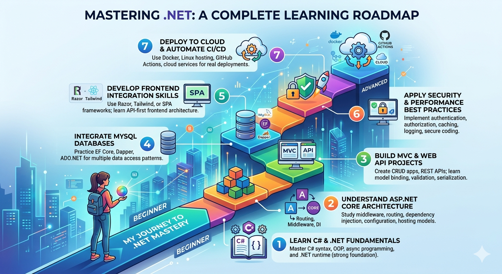

# **FULL LEARNING DOCUMENT  
Full‑Stack & Backend Development with ASP.NET (Core, MVC5, Web API) + MySQL + Frontend + Cloud + GitHub Workflows**

This document is designed as a **complete learning and reference guide** for becoming highly skilled in full‑stack and backend development using ASP.NET technologies. It covers:

- ASP.NET Core MVC  
- ASP.NET Core Web API  
- ASP.NET Minimal APIs  
- Legacy ASP.NET MVC 5  
- MySQL database integration (EF Core, Dapper, ADO.NET)  
- Frontend integration patterns  
- Cloud deployment (Linux, Windows, Docker, CI/CD)  
- GitHub workflows & release management  
- Security, performance, accessibility, UI/UX quality  
- Templates, cheat sheets, and step-by-step learning paths  

---

# **1. FOUNDATIONS OF ASP.NET TECHNOLOGIES**

## **1.1 ASP.NET Core (Modern, Cross‑Platform)**  
Key characteristics:
- Cross-platform (Linux, macOS, Windows)  
- High performance (Kestrel server)  
- Unified framework for MVC, Razor Pages, Web API, Blazor  
- Built-in dependency injection  
- Middleware pipeline  
- Minimal APIs for lightweight services  
- First-class support for Docker, cloud, microservices  

### **Core Concepts to Master**
- Program.cs & Startup-less hosting model  
- Middleware pipeline  
- Routing (attribute & conventional)  
- Controllers vs Minimal APIs  
- Model binding & validation  
- Configuration providers  
- Logging (Serilog, built-in logging)  
- EF Core integration  
- Identity & authentication  

---

## **1.2 ASP.NET MVC 5 (Legacy)**  
Still widely used in enterprise systems.

Key concepts:
- Controllers, Views, Razor  
- Web.config configuration  
- Filters (Action, Authorization)  
- Entity Framework 6  
- Bundling & Minification  
- IIS hosting  

Why learn it:
- Many organizations still maintain MVC5 systems  
- Understanding MVC5 helps you appreciate the evolution to ASP.NET Core  

---

# **2. BACKEND DEVELOPMENT SKILLS**

## **2.1 RESTful API Design (ASP.NET Core Web API)**  
Core principles:
- Resource-based routing  
- Stateless communication  
- JSON serialization (System.Text.Json)  
- Versioning strategies  
- Pagination, filtering, sorting  
- OpenAPI/Swagger documentation  
- Authentication (JWT, OAuth2)  
- Rate limiting  
- CORS policies  

---

## **2.2 Minimal APIs (ASP.NET Core)**  
Use cases:
- Microservices  
- Lightweight endpoints  
- High-performance scenarios  
- Rapid prototyping  

Key skills:
- Mapping endpoints  
- Binding parameters  
- Using filters  
- Adding authentication  
- OpenAPI integration  

---

# **3. DATABASE INTEGRATION WITH MYSQL**

## **3.1 EF Core (Recommended for most apps)**  
Skills to master:
- DbContext configuration  
- Migrations  
- Fluent API  
- LINQ queries  
- Tracking vs NoTracking  
- Relationship mapping  
- Connection resiliency  
- Using Pomelo MySQL provider  

---

## **3.2 Dapper (Micro‑ORM)**  
Use when:
- You need raw SQL performance  
- You want lightweight mapping  
- You need full control over queries  

Skills:
- Query, QueryFirst, Execute  
- Mapping to objects  
- Stored procedure support  

---

## **3.3 ADO.NET (Low-level)**  
Use when:
- You need maximum performance  
- You need full control over connections  
- You work with legacy systems  

Skills:
- MySqlConnection  
- MySqlCommand  
- DataReader  
- Transactions  

---

# **4. FRONTEND INTEGRATION PATTERNS**

## **4.1 Razor Views (MVC & MVC5)**  
- Layout pages  
- Partial views  
- View components  
- Strongly typed models  
- Tag helpers  

---

## **4.2 SPA Integration (React, Vue, Angular)**  
Patterns:
- API-first architecture  
- JWT authentication  
- CORS configuration  
- Reverse proxy (YARP, Nginx)  
- Serving SPA from ASP.NET Core  

---

## **4.3 UI/UX Quality & Accessibility**  
Key areas:
- WCAG 2.1 AA compliance  
- Color contrast ratios  
- Keyboard navigation  
- Focus states  
- ARIA attributes  
- Semantic HTML  
- Responsive design  
- Tailwind CSS patterns  

---

# **5. SECURITY BEST PRACTICES**

## **5.1 Authentication & Authorization**
- ASP.NET Identity  
- JWT tokens  
- OAuth2 / OpenID Connect  
- Role-based & policy-based authorization  

---

## **5.2 API Security**
- HTTPS enforcement  
- Rate limiting  
- Input validation  
- Anti-forgery tokens  
- CORS restrictions  
- Secret management (Azure Key Vault, environment variables)  

---

## **5.3 Data Security**
- Hashing & salting  
- Encryption at rest  
- Parameterized queries  
- Avoiding SQL injection  

---

# **6. PERFORMANCE OPTIMIZATION**

## **6.1 Server-Side**
- Response caching  
- Memory caching  
- Distributed caching (Redis)  
- Async/await everywhere  
- Minimize allocations  
- Use NoTracking queries  
- Connection pooling  

---

## **6.2 Database Performance**
- Indexing  
- Query optimization  
- Avoid N+1 queries  
- Stored procedures (when needed)  

---

## **6.3 Frontend Performance**
- Minification  
- Lazy loading  
- Image optimization  
- CDN usage  

---

# **7. CLOUD DEPLOYMENT**

## **7.1 Deployment Targets**
- Linux (Nginx + Kestrel)  
- Windows (IIS)  
- Docker containers  
- Kubernetes  
- Azure App Service  
- AWS Elastic Beanstalk  
- DigitalOcean droplets  

---

## **7.2 Deployment Patterns**
- Reverse proxy configuration  
- Environment-based configuration  
- Logging pipelines  
- Health checks  
- Zero-downtime deployment  

---

# **8. GITHUB WORKFLOWS & RELEASE MANAGEMENT**

## **8.1 GitHub Actions**
Key workflows:
- Build & test  
- Publish artifacts  
- Docker build & push  
- Deploy to cloud  
- Tagging & versioning  

---

## **8.2 Release Management**
- Semantic versioning  
- Release notes  
- Automated changelog generation  
- Branching strategies (GitFlow, trunk-based)  

---

# **9. UI/UX QUALITY REVIEW CHECKLIST**

## **9.1 Accessibility**
- Keyboard-only navigation  
- Focus indicators  
- Screen reader compatibility  
- ARIA roles  
- Contrast ratio ≥ 4.5:1  

---

## **9.2 Usability**
- Clear navigation  
- Consistent spacing  
- Mobile responsiveness  
- Error messages with guidance  

---

## **9.3 Visual Quality**
- Tailwind utility patterns  
- Component consistency  
- Iconography standards  

---

# **10. TEMPLATES & CHEAT SHEETS**

## **10.1 Architecture Templates**
- Clean Architecture  
- Onion Architecture  
- Modular monolith  
- Microservices layout  

---

## **10.2 API Design Cheat Sheet**
- Use nouns for resources  
- Use plural names  
- Use verbs only for actions  
- Return proper HTTP status codes  
- Include pagination metadata  

---

## **10.3 GitHub Workflow Template**
- Build → Test → Publish → Deploy  
- Auto-versioning  
- Auto-release notes  

---

## **10.4 Security Checklist**
- HTTPS only  
- Strong password policies  
- JWT expiration  
- Secret rotation  
- SQL injection prevention  

---

# **11. STEP‑BY‑STEP LEARNING PATH**

Below is your **structured learning roadmap**, from beginner to advanced.

**01.** Learn C# and .NET FundamentalsMaster C# syntax, OOP, async programming, and the .NET runtime to build a strong foundation.

**02.** Understand ASP.NET Core ArchitectureStudy middleware, routing, dependency injection, configuration, and hosting models.

**03.** Build MVC and Web API ProjectsCreate CRUD apps, REST APIs, and learn model binding, validation, and serialization.

**04.** Integrate MySQL DatabasesPractice EF Core, Dapper, and ADO.NET to understand multiple data access patterns.

**05.** Develop Frontend Integration SkillsUse Razor, Tailwind, or SPA frameworks and learn API-first frontend architecture.

**06.** Apply Security and Performance Best PracticesImplement authentication, authorization, caching, logging, and secure coding standards.

**07.** Deploy to Cloud and Automate CI/CDUse Docker, Linux hosting, GitHub Actions, and cloud services for real deployments.

---
